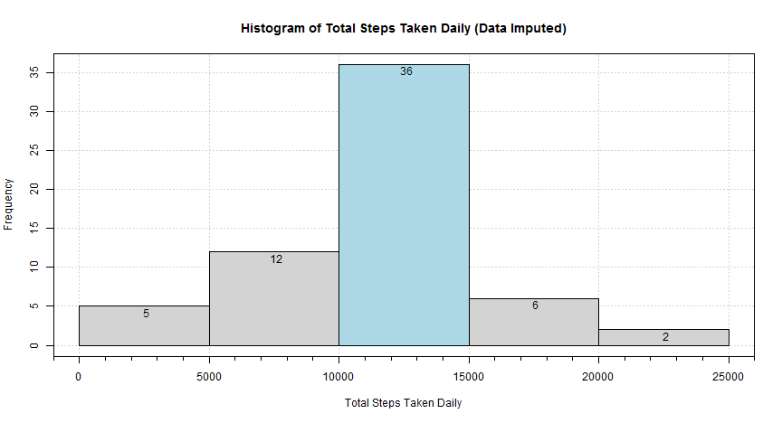

***  
## [Peer Assessment 1] Reproducible Research
### Data Science Specialization on Coursera
***  
**January 12, 2015**     
**Ian Huang**        
shuang4csa@hotmail.com    

***  
### Project Introduction
***
This assignment makes use of data from a personal activity-monitoring device. This device collects data at 5 minute intervals throughout the day. The data consists of two months of data from an anonymous individual collected during the months of October and November, 2012 and includes the number of steps taken in 5 minute intervals each day.    

The data for this assignment can be downloaded from the course web site:

- Dataset: <a href="https://d396qusza40orc.cloudfront.net/repdata/data/activity.zip">Activity monitoring data</a> [52KB]

The variables included in this dataset are:

- <b>steps:</b> Number of steps taking in a 5-minute interval (missing values are coded as NA)    
- <b>date:</b> The date on which the measurement was taken in YYYY-MM-DD format    
- <b>interval:</b> Identifier for the 5-minute interval in which measurement was taken    

The dataset is stored in a comma-separated-value (CSV) file and there are a total of 17,568 observations in this dataset.

***
### Task 1: Loading and preprocessing the data
***

<b>0. Setting up system environment</b>

Let's save your current computer system locale first, and temporarily set it to 'English' for presentation of all the tasks.


```r
# Save you current system's locale
locale <- Sys.getlocale(category = "LC_TIME")

# Set English locale in order to have axis labels printed in English
Sys.setlocale("LC_TIME", "English")
```

Now let's load some required R packages for this project


```r
if (!require("scales", quietly=TRUE)) {
    install.packages("scales", dependencies=TRUE)
}

if (!require("plyr", quietly=TRUE)) {
    install.packages("plyr", dependencies=TRUE)
}

if (!require("ggplot2", quietly=TRUE)) {
    install.packages("ggplot2", dependencies=TRUE)
}
```
<b>1. Load original dataset</b>

Please make sure the 'activity.zip' file is located in your working directory, and let's load the original dataset to your workspace and save it as 'rawDataOrigin'.


```r
# Check availability of the original dataset source in your working directory
if (!file.exists("./activity.zip")) {
    fileURL <- "https://d396qusza40orc.cloudfront.net/repdata/data/activity.zip"
    download.file(fileURL, destfile = "activity.zip", mode = "wb")
}

# Load data from the .zip file directly 
rawDataOrigin <- read.csv(unz("activity.zip", "activity.csv"), 
                          header = TRUE, 
                          colClasses = c("numeric", "character", "numeric"))

# A sneak preview of the original data
head(rawDataOrigin, n=3)
```

```
##   steps       date interval
## 1    NA 2012-10-01        0
## 2    NA 2012-10-01        5
## 3    NA 2012-10-01       10
```

```r
tail(rawDataOrigin, n=3)
```

```
##       steps       date interval
## 17566    NA 2012-11-30     2345
## 17567    NA 2012-11-30     2350
## 17568    NA 2012-11-30     2355
```
<b>2. Process/transform the data into a format suitable for analysis</b>

Now, let's do some data processing and save the processed dataset as 'processedData':

- Convert column 'date' to class of Date    
- Make column 'interval' to 4-digit characters    


```r
# Create a processed dataset from the original dataset 
processedData <- rawDataOrigin

# Convert 'date' column from class character to class Date
processedData$date <- as.Date(processedData$date, "%Y-%m-%d")

# Make column 'interval' to 4-digit characters
processedData$interval <- as.character(sprintf("%04d", processedData$interval))

# A sneak preview of the processed data
head(processedData, n=3)
```

```
##   steps       date interval
## 1    NA 2012-10-01     0000
## 2    NA 2012-10-01     0005
## 3    NA 2012-10-01     0010
```

```r
tail(processedData, n=3)
```

```
##       steps       date interval
## 17566    NA 2012-11-30     2345
## 17567    NA 2012-11-30     2350
## 17568    NA 2012-11-30     2355
```

***
### Task 2: What is mean total number of steps taken per day?
***

<b>1. Make a histogram of the total number of steps taken each day</b>


```r
# Calculate sum of steps by date
stepSumByDate <- aggregate(steps ~ date, data=processedData, sum, na.action=na.pass)

# The following is the histogram of the total number of steps taken each day
hist(stepSumByDate$steps, 
     col = gray(0.9), 
     main = "Histogram of Total Steps Taken Daily", 
     xlab = "Total Steps Taken Daily")
```

 

<b>2. Calculate and report the mean and median total number of steps taken per day</b>


```r
# Calculate mean of total steps per day, the value rounded and converted to characters for display.
stepMeanDaily <- as.character(round(mean(stepSumByDate$steps, na.rm=TRUE)))

# Calculate median of total steps per day, the value rounded and converted to characters for display.
stepMedianDaily <- as.character(round(median(stepSumByDate$steps, na.rm=TRUE)))
```
So the mean of total number of steps taken per day is <b>10766</b>, and the median of total number of steps taken per day is <b>10765</b>.

***
### Task 3: What is the average daily activity pattern?
***
<b>1. Make a time series plot of the 5-minute interval and the average number of steps taken, averaged across all 61 days </b>

```r
# Calculate the daily mean of steps per 5-minute intervals across measured 61 days.
stepMeanPerInterval <- aggregate(steps ~ interval, data=processedData, mean, na.action=na.omit)

# Compose a 'dataTime' vector as interval labels in 'HH:MM' format
dateTime <- strptime(stepMeanPerInterval$interval, format = "%H%M")
dateTime <- c(paste0(as.character(sprintf("%02d", dateTime$hour)), ":", 
                   as.character(sprintf("%02d", dateTime$min))), "00:00")

# The following is the figure of the mean of steps taken per time interval across measured 61 days
plot(stepMeanPerInterval$interval, stepMeanPerInterval$steps,
     type = "l", 
     col = "red",
     axes = FALSE,
     main = "Mean of Steps per 5-minute Intervals Daily",
     xlab = "Daily 5-minute Time Intervals (00:00-23:55)", 
     ylab = "Mean of Steps")
axis(1, seq(0,2400,100), dateTime[seq(1,289,12)])
axis(2)
abline(v = seq(0,2400,100), col = "lightgray", lty = "dotted")
abline(h = seq(0,200,50), col = "lightgray", lty = "dotted")
box()
```

 

<b>2. Which 5-minute interval, on average across all the days in the dataset, contains the maximum number of steps? </b>


```r
# Find the most active 5-minute interval daily
activeInterval <- stepMeanPerInterval$interval[stepMeanPerInterval$steps == max(stepMeanPerInterval$steps)]

# Format it to 'H:MM' string for display
activeInterval <- as.character(format(as.numeric(activeInterval)/100, decimal.mark = ":"))
```

On average across all the days in the dataset, the 5-minute interval of <b>8:35</b> contains the maximum number of steps.

***
### Task 4: Imputing missing values
***
<b>1. Calculate and report the total number of missing values in the dataset (i.e. the total number of rows with NAs)</b>

```r
totalNA <- sum(is.na(processedData$steps))
```
There are <b>2304</b> rows with NAs in the original dataset.

<b>2. Devise a strategy for filling in all of the missing values in the dataset.</b>

I will use the mean of that 5-minute interval across the measured 61 days for filling in all of the missing values in the original dataset.

<b>3. Create a new dataset that is equal to the original dataset but with the missing data filled in.</b>


```r
# Create a dataset with imputed value in column 'steps'
rawDataImputed <- join(processedData, stepMeanPerInterval, by = "interval")
rawDataImputed[,1][is.na(rawDataImputed$steps)] <- round(rawDataImputed[,4][is.na(rawDataImputed$steps)]) 
rawDataImputed <- rawDataImputed[,c(1:3)]

# A sneak preview of the Imputed data
head(rawDataImputed, n=3)
```

```
##   steps       date interval
## 1     2 2012-10-01     0000
## 2     0 2012-10-01     0005
## 3     0 2012-10-01     0010
```

```r
tail(rawDataImputed, n=3)
```

```
##       steps       date interval
## 17566     1 2012-11-30     2345
## 17567     0 2012-11-30     2350
## 17568     1 2012-11-30     2355
```

<b>4. Make a histogram of the total number of steps taken each day, then calculate and report the mean and median total number of steps taken per day. </b>


```r
# Calculate sum of steps per date
processedDataImputed <- rawDataImputed
stepSumByDateNew <- aggregate(steps ~ date, data=processedDataImputed, sum, na.action=na.pass)

# The following is the histogram of the total number of steps taken each day
hist(stepSumByDateNew$steps,
     col = gray(0.8), 
     main = "Histogram of Total Steps Taken Daily (Data Imputed)", 
     xlab = "Total Steps Taken Daily")
```

 

```r
# Calculate mean of total steps per day, the value rounded and converted to characters for display.
stepMeanDailyNew <- as.character(round(mean(stepSumByDateNew$steps)))

# Calculate median of total steps per day,the value rounded and converted to characters for display.
stepMedianDailyNew <- as.character(round(median(stepSumByDateNew$steps)))
```
So the new mean of total number of steps taken per day is <b>10766</b>, and the new median of total number of steps taken per day is <b>10762</b>.

Because I used the mean value of 5-minute interval across the 61 measured days filling in all of the missing values in the dataset, the new mean value remained the same as the previous one. However, the new median value shifted to a lower value slightly. Meanwhile, when we look at the histogram (with data imputed), we found that the frequency of a range from 10000-15000 steps daily got a big increase comparing to the previous histogram (with original data).   

***
### Task 5: Are there differences in activity patterns between weekdays and weekends?
***
<b>1. Create a new factor variable in the dataset with two levels - "Weekday" and "Weekend"</b>

```r
# Create a new factor column 'Day' in 'processedDataImputed' contains 2 levels - 'Weekday' and 'Weekend'
processedDataImputed$Day <- weekdays(processedDataImputed$date)
processedDataImputed$Day[processedDataImputed$Day=="Sunday"|processedDataImputed$Day=="Saturday"] <- "Weekend"
processedDataImputed$Day[processedDataImputed$Day!="Weekend"] <- "Weekday"
processedDataImputed$Day <- factor(processedDataImputed$Day)

# Calculate the weekday and weekend mean of steps per 5-minute intervals across 61 days. 
stepMeanPerIntervalDays <- aggregate(steps ~ interval+Day, data=processedDataImputed, mean)

# A sneak preview of stepMeanPerIntervalDays
head(stepMeanPerIntervalDays, n=3)
```

```
##   interval     Day     steps
## 1     0000 Weekday 2.2888889
## 2     0005 Weekday 0.4000000
## 3     0010 Weekday 0.1555556
```

```r
tail(stepMeanPerIntervalDays, n=3)
```

```
##     interval     Day steps
## 574     2345 Weekend 1.750
## 575     2350 Weekend 0.000
## 576     2355 Weekend 0.125
```
<b>2. Make a panel plot containing a time series plot of the 5-minute interval and the average number of steps taken, averaged across all weekday days or weekend days.</b> 

```r
# The following is the figure of the mean of steps taken per interval by all weekdays and weekends
g <- ggplot(stepMeanPerIntervalDays, aes(strptime(stepMeanPerIntervalDays$interval, format = "%H%M"), steps))
p <- g + geom_line(aes(colour = Day)) +
         facet_grid(Day ~.) + 
         scale_x_datetime(labels = date_format("%H:%M"), breaks = "2 hours") +
         theme(legend.position = "none") +
         labs(x = "Daily 5-minute Time Intervals (00:00 - 23:55)") + 
         labs(y = "Mean of Steps") +
         labs(title = "Mean of Steps Taken Comparison (Weekday vs. Weekend)")
print(p)
```

 

<b>How I interpret these figures</b> 

The person who participated in this experiment is walking over 10000 steps on average a day therefore living a easy life. I think she is an aged female, who has a job position in an office. As a good habit, she always wakes up early around 5:30 during both weekdays and weekends. She usually walks to her work place (probably only one mile away from home) around 9:00 in the morning and regularly eats lunch at 12:00, and maybe enjoy an afternoon snack/tea time at 16:00. She always takes buses and walks home around 19:00 and she does only minor house activities between 20:00-22:00 during weekdays. The house work is the biggest workload during her weekends' afternoon. She usually goes to bed around 22:30 every day. Her walking speed is much slower than the average person's, which makes me think she may have some physical difficuties. 

***

Finally, let's restore your computer system locale back to the original

```r
# Restore your system's original locale
Sys.setlocale("LC_TIME", locale)
```
